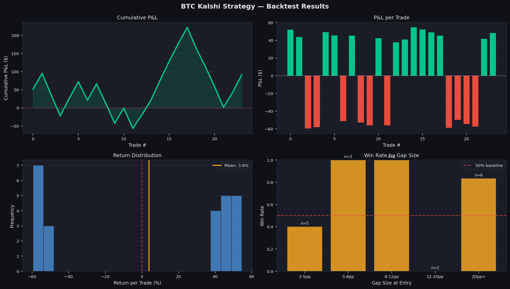

# Kalshi BTC Arbitrage

**Finding mispriced Kalshi Bitcoin contracts with Black-Scholes and machine learning.**

Kalshi lists daily binary contracts on Bitcoin's price ("Will BTC be above $X at the close?"). This project prices each contract with a Black-Scholes binary-option model, measures the gap between that fair probability and the market's traded price, and trains classifiers to predict which gaps actually resolve profitably. A backtest engine and a Streamlit dashboard sit on top.

## Results (out-of-sample)

Evaluated on a chronological hold-out (the most recent 20% of markets, Sep 7 – Nov 11, 2025), never seen during training:

| Metric | Value |
|---|---|
| Trades taken | 24 |
| Win rate | **58.3%** (14 / 24) |
| Average return per trade | **+3.81%** |
| Total P&L | +$91.33 on $100 positions |

Costs are modeled at 0.5¢ per side (1¢ round trip). The strategy is deliberately selective: it only trades when the model is confident, the entry price is in the uncertain 38–62¢ band, and BTC momentum confirms the direction. That keeps the sample small, so treat these numbers as promising rather than statistically conclusive.



## How it works

1. **Data**: Kalshi `KXBTCD` daily-close markets and trades (Parquet, queried with DuckDB), plus hourly BTC-USD prices.
2. **Fair value**: a Black-Scholes (log-normal) binary call probability from BTC's price, the strike, hourly volatility, and time to expiry.
3. **Features (23)**: the gap between fair value and market price, rolling historical edge, BTC momentum (1d/3d/7d returns), realized volatility (24h/168h), RSI, strike proximity, regime flags, and time-of-day / day-of-week. Rolling features are lagged to avoid look-ahead.
4. **Models**, trained on a temporal 80/20 split with no shuffling:
   - Logistic Regression (scaled baseline)
   - Random Forest (200 trees, depth 6)
   - **XGBoost** (300 trees, depth 4, lr 0.05), which drives the live signal
   - An XGBoost regressor on price convergence, used for diagnostics
5. **Backtest**: a confidence threshold (> 0.55), the entry-price band, a momentum-confirmation rule, and transaction costs. Reports win rate, P&L, annualized Sharpe, and max drawdown.

## Dashboard

`app.py` is a three-tab Streamlit app:

- **Live Signal**: pulls the current BTC price and returns BUY YES / BUY NO / NO TRADE for any strike you enter
- **Backtest**: equity curve, trade table, and P&L breakdown
- **Model**: ROC curves, feature importances, and model metrics

```bash
pip install -r requirements.txt
streamlit run app.py          # uses the trained artifacts in output/
```

## Retraining

The Kalshi market data comes from Jon Becker's public [prediction-market-analysis](https://github.com/Jon-Becker/prediction-market-analysis) dataset (~36 GB compressed; not included here). Download it, place the Parquet files under `data/`, then run:

```bash
python main.py    # load → features → models → backtest → output/
```

## Project layout

```
├── app.py              Streamlit dashboard
├── main.py             Training + backtest pipeline
├── src/
│   ├── data_loader.py  DuckDB loader, BTC prices, Black-Scholes fair probability
│   ├── features.py     23-feature engineering + classification/regression targets
│   ├── models.py       Temporal split, LR / RF / XGBoost, ROC + importance plots
│   └── backtest.py     Signal filters, P&L, Sharpe, drawdown
└── output/             Trained model artifacts, trade log, charts
```

## Stack

Python · XGBoost · scikit-learn · SciPy · pandas · DuckDB · Streamlit

---

Built by William Felipe Quiroz as a FINA 4390 capstone at Northeastern University · [LinkedIn](https://www.linkedin.com/in/wf-quiroz)
